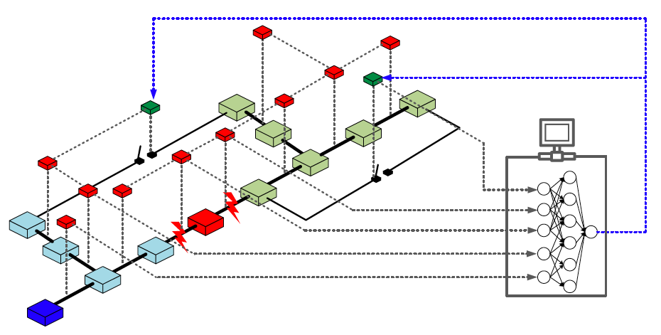
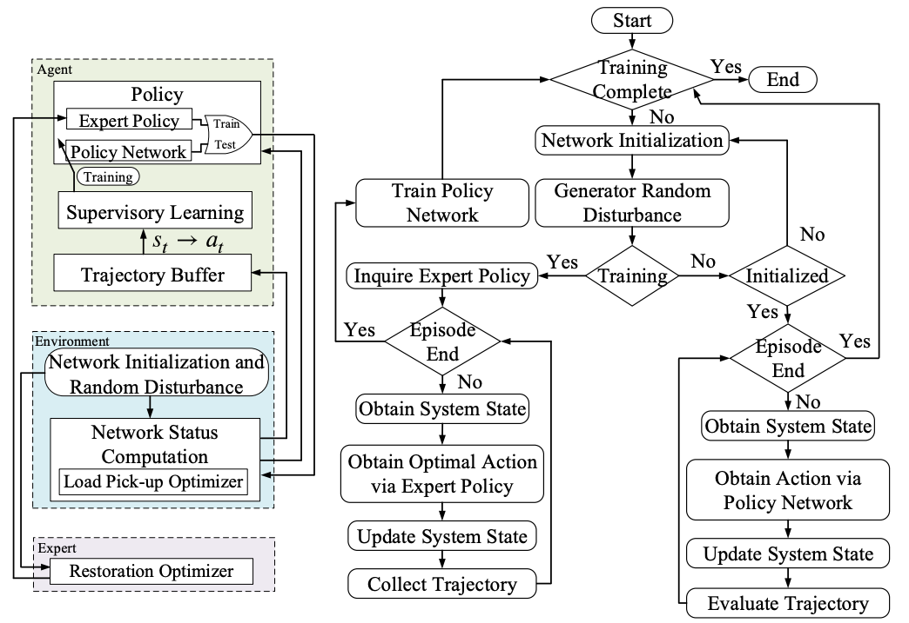
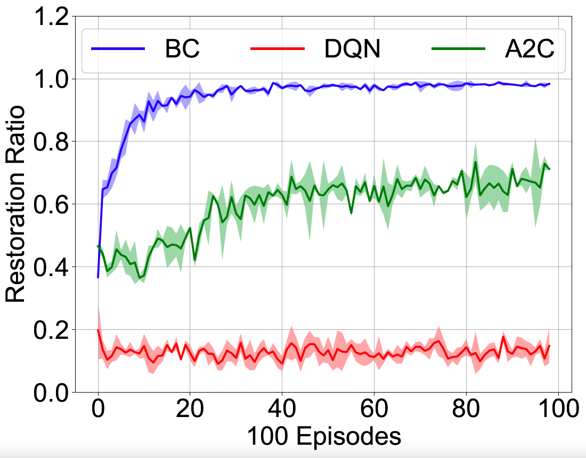
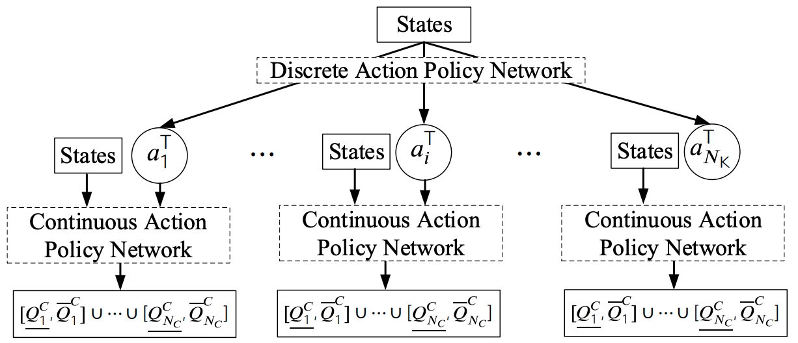

# IntelliHealer

[](https://intellihealer.readthedocs.io/en/latest/?badge=latest)

**IntelliHealer**: An imitation and reinforcement learning platform for 
self-healing distribution networks.



IntelliHealer uses imitation learning framework to learn restoration policy 
for distribution system service restoration so as to perform the restoration 
actions (tie-line switching and reactive power dispatch) in real time and in 
embedded environment.



Such **embeddable** and **computation-free** policies allows us to integrate the 
self-healing capability into intelligent devices 
A polit project conducted by the [S&C Electric](https://www.sandc.com/en/)
can be found [here](https://www.sandc.com/en/solutions/self-healing-grids/).
For details of this work, please refer to our paper at 
[arXiv](https://arxiv.org/abs/2011.14458/) 
or [IEEE](https://ieeexplore.ieee.org/document/9424985?denied=).

Features
--------
* **IntelliHealer proposes the imitation learning framework,** 
  which improve the sample efficiency using a mixed-integer program-based expert 
  compared with the traditional exploration-dominant reinforcement learning algorithms.
  
  
  
* **IntelliHealer proposes a hierarchical policy network,** 
  which can accommodate both discrete and continuous actions. 
  
  
 
* **IntelliHealer provides an [OpenAI-Gym](https://gym.openai.com/) environment for 
  distribution system restoration,** 
  which can be connected to [Stable-Baselines3](https://stable-baselines3.readthedocs.io/en/master/?badge=master), 
  a state-of-the-art collection of reinforcement learning algorithms. Currently, the Gym environment
  contains two test feeders: 33-node and 119-node system.

Documentation
-------------

For installation instructions, basic usage and benchmarks results, see the [official documentation](https://intellihealer.readthedocs.io/en/latest/).

Acknowledgments
---------------
* Based upon work supported by the **U.S. Department of Energy Advanced Grid Modeling Program** under Grant DE-OE0000875.

Citing IntelliHealer
---------------

If you find this code useful in your research, please consider citing:
```
Y. Zhang, F. Qiu, T. Hong, Z. Wang, and F. Li, “Hybrid imitation learning for real-time service restoration in resilient distribution systems,” IEEE Trans. Ind. Informat., pp. 1-11,early access, 2021, doi: 10.1109/TII.2021.3078110.
```
```bibtex
@article{Zhang2021_IntelliHealer,
author = {Zhang, Yichen and Qiu, Feng and Hong, Tianqi and Wang, Zhaoyu and Li, Fangxing Fran},
journal = {IEEE Trans. Ind. Informat.},
keywords = {Deep learning,Imitation learning,Mixed-integer linear programming,Reinforcement learning,Resilient distribution system,Service restoration},
pages = {1--11},
note={early access},
title = {{Hybrid imitation learning for real-time service restoration in resilient distribution systems}},
year = {2021}
}
```
License
-------

Released under the modified BSD license. See `LICENSE` for more details.
